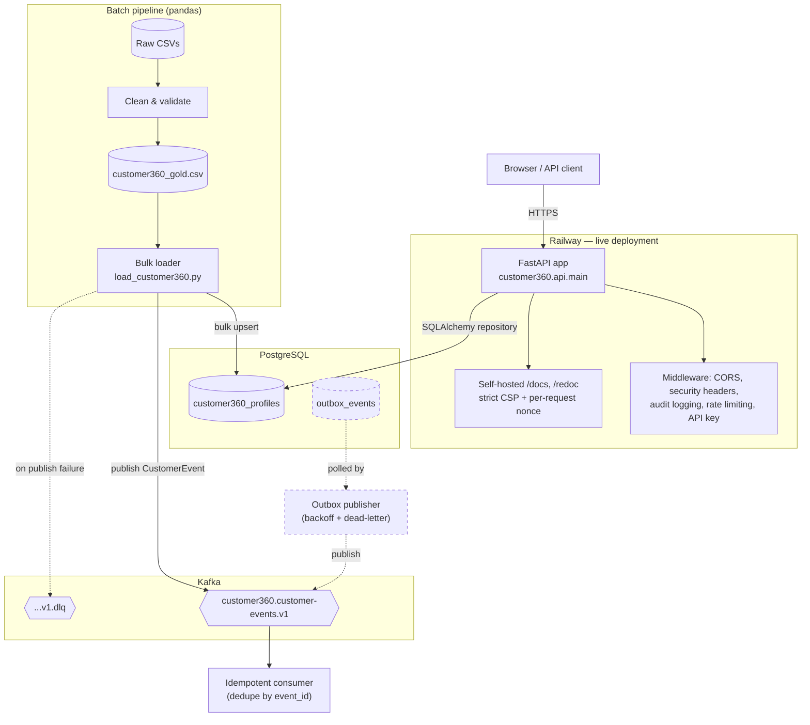
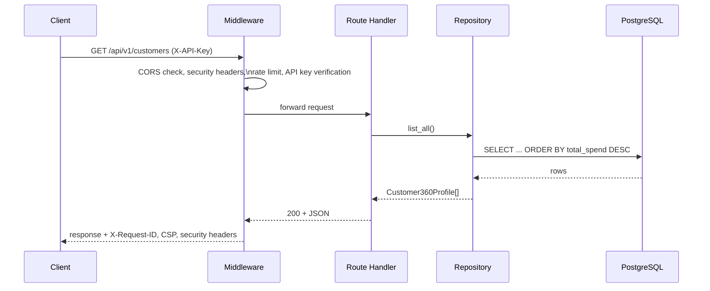
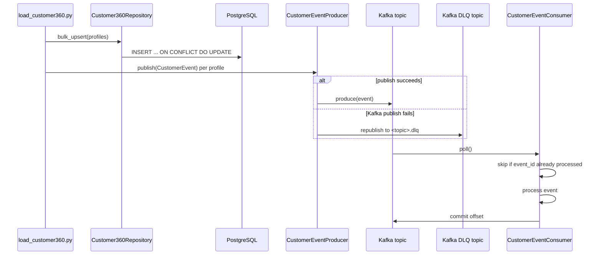

# Customer360 Platform

**A production-style customer data platform demonstrating backend architecture, event-driven data engineering, and secure API design — built solo and deployed end to end.**

[](https://github.com/pbolla1311/customer360-platform/actions/workflows/tests.yml)


---

## Live Demo

The API is deployed and publicly reachable on Railway.

| Resource | URL |
| --- | --- |
| Application root | <https://customer360-platform-production.up.railway.app> |
| Swagger UI | <https://customer360-platform-production.up.railway.app/docs> |
| ReDoc | <https://customer360-platform-production.up.railway.app/redoc> |
| OpenAPI schema | <https://customer360-platform-production.up.railway.app/openapi.json> |

> The `/customers` endpoints require an `X-API-Key` header, verified server-side against the `API_KEY` environment variable. That variable isn't currently set on the live Railway deployment, so `/customers` there returns `503 API security is not configured` rather than serving data — the endpoint fails closed instead of silently allowing access. It works end-to-end locally and in CI, where `API_KEY` is set. Everything else — root, health, readiness, docs, and the OpenAPI schema — is open on the live demo.

---

## Overview

Customer360 Platform is a backend system that ingests customer and transaction data, builds a unified "Customer 360" profile per customer, and exposes it through a versioned, secured, observable FastAPI service. It's built to look and behave like an internal enterprise service rather than a demo script: structured logging, audit trails, rate limiting, a strict Content-Security-Policy, database migrations, an event-driven ingestion path with retry and dead-lettering semantics, and infrastructure-as-code for both Kubernetes and AWS.

The read path is simple by design — `GET /customers` and `GET /customers/{id}` — so the project's depth lives in *how* that data gets there and *how* the service is operated: a pandas-based batch pipeline that cleans raw CSVs into a "gold" dataset, a repository layer that bulk-upserts it into PostgreSQL, a Kafka producer that publishes a domain event per profile, an idempotent Kafka consumer, and a separately implemented transactional outbox module with exponential backoff and dead-lettering.

## Why This Project

This repository exists to demonstrate how I approach backend and platform engineering when the goal is production quality, not just a working demo:

- **API design** — versioned routes, typed Pydantic models, explicit error responses, and machine-readable OpenAPI docs.
- **Data engineering** — a batch cleaning/transformation pipeline feeding a relational store, plus an event-driven path for downstream consumers.
- **Reliability engineering** — retries, exponential backoff, dead-letter handling, and idempotent consumption instead of "happy path only" code.
- **Security engineering** — a strict CSP with no `unsafe-inline` anywhere (including on self-hosted Swagger/ReDoc docs, which is a genuinely fiddly problem — see [Engineering Decisions](#engineering-decisions)), API-key auth, rate limiting, and hardened HTTP headers.
- **Operability** — structured JSON logs, per-request audit logging, health/readiness endpoints, and containerized/orchestrated deployment artifacts.
- **Delivery discipline** — CI that runs lint, strict type checking, tests against real PostgreSQL and Kafka services, Terraform validation, and a Docker build on every push.

## Key Features

### API & Backend

- FastAPI application with Pydantic request/response models and OpenAPI 3.1 schema generation
- API versioning: every resource route is served at both an unversioned path and under `/api/v1`
- Repository pattern (`Customer360Repository`) isolating SQLAlchemy access from route handlers
- Self-hosted Swagger UI and ReDoc — no external CDN dependency, compatible with a strict CSP

### Data & Messaging

- Pandas-based batch ingestion pipeline: raw CSV → validation/cleaning → merged "gold" Customer 360 dataset
- Bulk upsert into PostgreSQL via `INSERT ... ON CONFLICT DO UPDATE`
- Kafka producer publishing a `CustomerEvent` per loaded profile, with idempotent producer settings (`enable.idempotence`, `acks=all`)
- Kafka consumer with in-process idempotent de-duplication by event ID and manual offset commits (at-least-once delivery)
- A separate, fully tested transactional outbox module (table, repository, publisher) implementing exponential backoff and dead-lettering — see [Limitations](#limitations) for its current integration status

### Reliability Highlights

- Producer-side dead-letter redirect (`<topic>.dlq`) on publish failure
- Outbox-side exponential backoff (`2^retry_count` seconds) with a configurable max-retry count before dead-lettering
- `/health` (liveness) and `/ready` (readiness, verifies a live DB connection) endpoints
- Kubernetes liveness/readiness probes and an HPA wired to those same endpoints

### Security Highlights

- API-key authentication (`X-API-Key`) on customer data endpoints
- Per-route rate limiting via SlowAPI (`60/minute` list, `120/minute` detail), with `429` responses
- Strict `Content-Security-Policy` (`default-src 'self'`, `script-src 'self'`, per-request nonce on `style-src`) with **no `unsafe-inline`**
- Hardened response headers: `X-Content-Type-Options`, `X-Frame-Options`, `Referrer-Policy`, `Permissions-Policy`, `Strict-Transport-Security`
- Explicit CORS allow-list (no wildcard origins)
- Path parameter validation (length + character allow-list) rejecting malformed customer IDs before they hit the database

### Observability Highlights

- Structured JSON logging for every log line (custom `JsonFormatter`)
- Audit logging middleware recording method, path, status, latency, client IP, and a request ID (`X-Request-ID`, generated or propagated) for every HTTP request
- Prometheus `Counter`/`Histogram` metric definitions in `customer360/metrics/prometheus.py` (see [Limitations](#limitations) — not yet wired to a `/metrics` endpoint)

### DevOps & Infrastructure

- Multi-stage-ready `Dockerfile` and a `docker-compose.yml` for local PostgreSQL + Kafka
- Kubernetes manifests: `Deployment`, `Service`, `ConfigMap`, `Secret`, `HorizontalPodAutoscaler` — hardened with a non-root, read-only-filesystem `securityContext`
- Terraform modules for AWS (VPC/network, RDS PostgreSQL, S3, IAM) validated in CI
- GitHub Actions CI: lint, strict mypy, tests against real Postgres + Kafka service containers, Terraform `fmt`/`validate`, and a Docker build
- Alembic migrations tracking both the profile table and the outbox table
- Live deployment on Railway

## Architecture

The system is organized into four layers:

1. **API layer** (`customer360/api/`) — the FastAPI app, middleware stack (CORS, security headers, audit logging), rate limiting, API-key auth, and the self-hosted docs routes.
2. **Infrastructure layer** (`customer360/infrastructure/`) — the SQLAlchemy model, session/engine setup, and the repository that mediates all database access.
3. **Data & messaging layer** (`customer360/ingestion/`, `customer360/spark/`, `customer360/messaging/`, `customer360/outbox/`) — the batch cleaning pipeline, the Customer 360 merge step, the Kafka producer/consumer, and the outbox pattern implementation.
4. **Delivery layer** — Docker for containerization, Kubernetes manifests for orchestration, Terraform for AWS infrastructure, and GitHub Actions for CI. Railway builds and runs the container for the public demo.

> Note: the `customer360/spark/` module is a pandas-based transformation pipeline, not Apache Spark/PySpark — the directory name reflects its role in the data pipeline (the "bronze → gold" merge step), not the underlying engine.

## Architecture Diagram



*Dashed elements (outbox publisher and table) are implemented and unit-tested but not currently invoked from the live request or ingestion path — see [Limitations](#limitations).*

## Request and Event Flow

**Synchronous read request:**



**Batch ingestion → event publish:**



## Technology Stack

| Layer | Technology |
| --- | --- |
| API framework | FastAPI, Uvicorn |
| Validation / schemas | Pydantic v2 |
| ORM / database access | SQLAlchemy 2.0 (typed `Mapped` columns) |
| Database | PostgreSQL (production/CI), SQLite (local default fallback) |
| Migrations | Alembic |
| Messaging | Apache Kafka via `confluent-kafka` |
| Rate limiting | SlowAPI |
| Metrics | `prometheus-client` (definitions only — see [Limitations](#limitations)) |
| Batch data processing | pandas |
| Testing | pytest, pytest-cov, FastAPI `TestClient` |
| Lint / formatting | Ruff |
| Type checking | mypy (strict mode) |
| Containerization | Docker |
| Orchestration | Kubernetes manifests (Deployment, Service, HPA, ConfigMap, Secret) |
| Infrastructure as Code | Terraform (VPC, RDS, S3, IAM modules for AWS) |
| CI/CD | GitHub Actions |
| Live hosting | Railway |

## API Endpoints

All customer-data endpoints are exposed twice: once unversioned (for the live docs/demo) and once under `/api/v1`, so the same handler is reachable at both paths.

| Method | Path | Auth | Rate limit | Description |
| --- | --- | --- | --- | --- |
| `GET` | `/` | none | — | Application status |
| `GET` | `/health`, `/api/v1/health` | none | — | Liveness check |
| `GET` | `/ready`, `/api/v1/ready` | none | — | Readiness check (verifies DB connectivity) |
| `GET` | `/customers`, `/api/v1/customers` | `X-API-Key` | 60/min | List customer profiles |
| `GET` | `/customers/{customer_id}`, `/api/v1/customers/{customer_id}` | `X-API-Key` | 120/min | Get a single customer profile |
| `GET` | `/docs` | none | — | Self-hosted Swagger UI |
| `GET` | `/redoc` | none | — | Self-hosted ReDoc |
| `GET` | `/openapi.json` | none | — | OpenAPI 3.1 schema |

The API is currently **read-only** over HTTP — profile creation/updates happen through the batch ingestion pipeline, not through write endpoints (see [Limitations](#limitations)).

## Data Model

**`customer360_profiles`** — the unified customer record served by the API:

| Column | Type | Notes |
| --- | --- | --- |
| `customer_id` | `String(100)` | Primary key |
| `first_name`, `last_name` | `String(100)` | |
| `email` | `String(255)` | Unique, indexed |
| `city`, `state` | `String(100)`, nullable | |
| `transaction_count` | `Integer` | Default `0` |
| `total_spend` | `Float` | Default `0.0` |
| `average_transaction_value` | `Float` | Default `0.0` |
| `created_at`, `updated_at` | `DateTime` | `updated_at` auto-updates on write |

**`outbox_events`** — outbox pattern table (see [Limitations](#limitations) for integration status):

| Column | Type | Notes |
| --- | --- | --- |
| `id` | `Integer` | Primary key, autoincrement |
| `event_id` | `String(36)` | Unique, indexed |
| `event_type` | `String(100)` | |
| `payload` | `Text` | Serialized event JSON |
| `status` | `String(20)` | `PENDING` / `PUBLISHED` / `FAILED` |
| `retry_count` / `max_retries` | `Integer` | Default `0` / `5` |
| `dead_lettered` | `Boolean` | Set once `retry_count >= max_retries` |
| `next_retry_at` | `DateTime`, nullable | Exponential backoff schedule |
| `created_at` / `published_at` | `DateTime` | |

## Reliability Patterns

| Pattern | Where | Behavior |
| --- | --- | --- |
| Transactional outbox | `customer360/outbox/` | Events are written to a DB table with retry accounting; a publisher polls `PENDING` rows and marks them `PUBLISHED` or reschedules them |
| Exponential backoff | `OutboxRepository.increment_retry` | Next retry scheduled at `now + 2^retry_count` seconds |
| Dead-letter queue (producer) | `CustomerEventProducer.publish` | On Kafka publish failure, the event is republished to `<topic>.dlq` |
| Dead-letter queue (outbox) | `OutboxRepository.increment_retry` | Row is flagged `dead_lettered=True`, `status="FAILED"` after `max_retries` |
| Idempotent consumption | `CustomerEventConsumer.consume` | Tracks processed `event_id`s in-process and skips duplicates before committing offsets |
| Idempotent producer | `CustomerEventProducer.__init__` | `enable.idempotence=True`, `acks=all` |
| Idempotent writes | `Customer360Repository.bulk_upsert` | `INSERT ... ON CONFLICT DO UPDATE` keyed on `customer_id` |
| Liveness / readiness | `/health`, `/ready` | `/ready` performs a real `SELECT 1` against the configured database |

## Security

- **Strict Content-Security-Policy** — `default-src 'self'; script-src 'self'; style-src 'self' 'nonce-<per-request>'; frame-ancestors 'none'; base-uri 'self'; form-action 'self'`. No `unsafe-inline` or `unsafe-eval` anywhere, including on the documentation pages.
- **Self-hosted API docs** — Swagger UI and ReDoc assets are vendored under `customer360/api/static/` and served from the app itself; nothing is loaded from a third-party CDN. ReDoc renders via `styled-components`, which injects `<style>` tags at runtime — since Chrome only honors a nonce set through an element's `.nonce` property (not `setAttribute`), a small bootstrap script patches `document.createElement` before the ReDoc bundle loads so every dynamically created style tag carries the correct per-request nonce.
- **API-key authentication** — `X-API-Key` header, checked via a FastAPI dependency; missing server-side configuration fails closed with `503` rather than silently allowing access.
- **Rate limiting** — SlowAPI, per-route limits, `429 Too Many Requests` with `X-RateLimit-*` and `Retry-After` headers exposed via CORS.
- **CORS** — explicit origin allow-list (`CORS_ALLOWED_ORIGINS`), `GET`-only, no wildcard.
- **Security headers** — `X-Content-Type-Options: nosniff`, `X-Frame-Options: DENY`, `Referrer-Policy: no-referrer`, `Permissions-Policy`, `Strict-Transport-Security`.
- **Input validation** — customer IDs are constrained by length and an explicit character allow-list at the route layer, rejecting malformed input before it reaches a query.

## Observability

- **Structured JSON logging** — every log record is emitted as a single JSON line (timestamp, level, logger, message, plus any structured `extra` fields) via a custom `JsonFormatter`.
- **Audit logging middleware** — every HTTP request logs method, path, status code, duration, client IP, and a request ID; the same ID is echoed back as `X-Request-ID`.
- **Health/readiness endpoints** — `/health` for liveness, `/ready` for a real database connectivity check, both wired into the Kubernetes probes.
- **Metrics (partial)** — `Counter`/`Histogram` definitions exist in `customer360/metrics/prometheus.py`, but they are not yet incremented by the request path and there is no `/metrics` endpoint exposed. Treat this as scaffolding, not a working Prometheus integration — see [Roadmap](#roadmap).

## Testing and Code Quality

- **68 tests** across 12 files (`pytest`), covering the API (auth, rate limiting, CORS, docs/CSP, validation), the repository layer, bulk upsert, the batch loader, Kafka producer/consumer/schemas, and the outbox repository/publisher.
- An `integration`-marked test performs a real Kafka publish/consume round trip; CI runs it against a live Kafka service container (no mocking).
- **Ruff** for linting (`E`, `F`, `I`, `UP`, `B` rule sets).
- **mypy --strict** for type checking.
- **CI** (`.github/workflows/tests.yml`) runs, on every push/PR: Ruff, strict mypy, the full test suite against real PostgreSQL + Kafka service containers, Alembic migrations, `terraform fmt`/`validate`, and a Docker build.

```bash
python -m pytest --cov=customer360 --cov-report=term-missing
python -m ruff check .
python -m mypy customer360
```

## Local Development

```bash
git clone https://github.com/pbolla1311/customer360-platform.git
cd customer360-platform

python3 -m venv .venv
source .venv/bin/activate

pip install -e ".[dev]"

cp .env.example .env

uvicorn customer360.api.main:app --reload
```

The app defaults to a local SQLite file (`customer360.db`) when `DATABASE_URL` is unset, so the API and its tests run without any external services. Kafka-dependent code (the producer, consumer, and the batch loader's event publishing step) has no offline fallback — it needs a reachable broker (`KAFKA_BOOTSTRAP_SERVERS`, default `localhost:9092`). For PostgreSQL/Kafka parity with CI and production, use the Docker Compose stack below.

## Docker Setup

`docker-compose.yml` provisions local PostgreSQL and Kafka (the application itself runs on the host, pointed at them via `.env`):

```bash
docker compose up -d      # or: make up
docker compose ps
docker compose logs -f    # or: make logs
docker compose down       # or: make down
```

To build and run the API itself in a container:

```bash
docker build -t customer360-platform .
docker run --rm -p 8000:8000 --env-file .env customer360-platform
```

## Database Migrations

```bash
python -m alembic upgrade head        # apply all migrations
python -m alembic history             # view the revision chain
python -m alembic revision --autogenerate -m "description"
```

Current revision chain:

1. `b8584a766c1f` — create `customer360_profiles` table
2. `12c285050662` — add `outbox_events` table
3. `f45862c54dbc` — add retry and dead-letter-queue fields
4. `1811e890ede7` — add `next_retry_at` timestamp

## Kubernetes Deployment

Manifests live under [`k8s/`](k8s/): `deployment.yaml`, `service.yaml`, `configmap.yaml`, `secret.yaml`, and `hpa.yaml`. The Deployment runs as non-root with a read-only root filesystem and no extra Linux capabilities, wires `/health`/`/ready` into liveness/readiness probes, and the HPA scales 2–6 replicas on 70% CPU utilization.

**These manifests are included in the repository and are not currently applied to a live cluster.** To try them against your own cluster:

```bash
kubectl apply -f k8s/configmap.yaml
kubectl apply -f k8s/secret.yaml        # replace placeholder values first
kubectl apply -f k8s/deployment.yaml
kubectl apply -f k8s/service.yaml
kubectl apply -f k8s/hpa.yaml
```

## Terraform Infrastructure

Terraform modules under [`terraform/`](terraform/) define AWS infrastructure: a VPC with public/private subnets (`modules/network`), an RDS PostgreSQL instance (`modules/rds`), an S3 bucket (`modules/s3`), and an application IAM role (`modules/iam`).

**This infrastructure is `terraform validate`-checked in CI on every push; it is not continuously applied, and the GitHub Actions workflow that would build/publish a container to AWS is currently disabled** (`.github/workflows-disabled/cd.yml`). To provision it yourself:

```bash
cd terraform
cp terraform.tfvars.example terraform.tfvars   # fill in your own values
terraform init
terraform plan
terraform apply
```

## Railway Deployment

**Railway hosts the public live demo** linked at the top of this README. Railway builds the repository's `Dockerfile` directly and runs `uvicorn customer360.api.main:app`; pushes to `main` trigger an automatic redeploy. This is the only environment where the application is actually running continuously — the Kubernetes and Terraform/AWS paths are implemented and validated but not live (see above).

## Project Structure

```text
customer360-platform/
├── customer360/
│   ├── api/                # FastAPI app, middleware, security, self-hosted docs
│   │   └── static/         # Vendored Swagger UI / ReDoc assets
│   ├── infrastructure/     # SQLAlchemy models, session, repository, bulk loader
│   ├── ingestion/          # Raw CSV cleaning/validation
│   ├── spark/              # Pandas-based Bronze→Gold transformation
│   ├── messaging/          # Kafka producer, consumer, event schemas, settings
│   ├── outbox/             # Transactional outbox model, repository, publisher
│   ├── metrics/            # Prometheus metric definitions
│   ├── config.py           # Environment-driven configuration
│   └── logging_config.py   # Structured JSON logging setup
├── alembic/                # Database migrations
├── k8s/                    # Kubernetes manifests
├── terraform/              # AWS infrastructure modules
├── tests/                  # pytest suite (unit + integration)
├── docker-compose.yml      # Local PostgreSQL + Kafka
├── Dockerfile
├── DEPLOYMENT.md
└── .github/
    ├── workflows/tests.yml           # CI: lint, types, tests, terraform, docker build
    └── workflows-disabled/cd.yml     # AWS/ECR publish workflow (currently disabled)
```

## Example API Requests

Against the live Railway deployment:

```bash
# Application status
curl https://customer360-platform-production.up.railway.app/

# Liveness
curl https://customer360-platform-production.up.railway.app/health

# Readiness (checks the database connection)
curl https://customer360-platform-production.up.railway.app/ready

# OpenAPI schema
curl https://customer360-platform-production.up.railway.app/openapi.json

# List customers (requires X-API-Key; the live demo has no API_KEY configured,
# so this currently returns 503 "API security is not configured" rather than
# data — see the note in Live Demo above)
curl -H "X-API-Key: <YOUR_API_KEY>" \
  https://customer360-platform-production.up.railway.app/customers

# Get a single customer profile
curl -H "X-API-Key: <YOUR_API_KEY>" \
  https://customer360-platform-production.up.railway.app/customers/CUST00001
```

Against a local instance (with `API_KEY` set, e.g. via `.env`):

```bash
curl -H "X-API-Key: $API_KEY" http://localhost:8000/api/v1/customers
```

## Engineering Decisions

- **Repository pattern over inline SQLAlchemy queries.** Route handlers depend on `Customer360Repository`, not the ORM session directly, so query logic, error handling, and logging are centralized and independently testable.
- **Read/write split between the API and the batch pipeline.** The HTTP API is intentionally read-only; profile data is produced by the batch loader. This keeps the request path simple and pushes bulk-write concerns (batching, upsert semantics) into a component designed for them.
- **Two retry/DLQ strategies, on purpose.** The Kafka producer's immediate DLQ redirect handles hard publish failures; the outbox module's exponential backoff models a slower, more patient retry policy for a durable, at-least-once delivery guarantee. They're implemented as separate, independently tested components rather than conflated into one.
- **Strict CSP with no exceptions, even for vendor JS.** Rather than adding `unsafe-inline` to make Swagger UI/ReDoc work, both toolchains' bootstrap code was moved into external scripts, and ReDoc's runtime style injection was solved with a `document.createElement` patch plus a per-request nonce — keeping `script-src`/`style-src` genuinely strict instead of relaxing the policy to fit the tooling.
- **API versioning without route duplication logic.** Each resource is registered once per path (unversioned and `/api/v1`) using the same handler function, so there's a single source of truth for behavior while still exposing a versioned contract.
- **SQLite as the zero-config local default.** `DATABASE_URL` falls back to a local SQLite file so the API and most of the test suite run without Docker; PostgreSQL is used in CI and production to catch dialect-specific issues (e.g., `INSERT ... ON CONFLICT`) before they ship.

## Limitations

Being direct about the current gaps:

- **The API is read-only.** There are no `POST`/`PUT`/`DELETE` endpoints; writes happen only through the batch pipeline.
- **The outbox pattern is implemented and tested but not wired in.** `OutboxRepository`/`OutboxPublisher` are exercised by their own test suite and have a migrated table, but nothing in the live ingestion path currently writes to or drains that table — the batch loader publishes to Kafka directly.
- **No standalone Kafka consumer process is deployed.** `CustomerEventConsumer` is implemented and covered by a real broker round-trip integration test, but there's no long-running worker (Kubernetes Deployment, entrypoint script, etc.) that runs it continuously.
- **Idempotent de-duplication is in-process only.** The consumer's processed-event tracking is an in-memory set; it resets on restart and isn't shared across consumer instances.
- **Prometheus metrics aren't exposed.** The `Counter`/`Histogram` objects exist but aren't incremented by request handling, and there is no `/metrics` endpoint.
- **The `spark/` module uses pandas, not Apache Spark.** No PySpark dependency is installed; the module name reflects its role in a Bronze→Gold pipeline, not the execution engine.
- **`dbt/models/` and `airflow/dags/` are empty placeholders**, as are the top-level `ingestion/`, `scripts/`, `quality/`, `infrastructure/`, `diagrams/`, and `demo/` directories.
- **No Streamlit dashboard exists**, despite `streamlit` being listed as a dependency and `apps/dashboard/` existing as an empty directory.
- **AWS deployment is not live.** Terraform is validated in CI and Kubernetes manifests are included, but the workflow that would publish a container to AWS is disabled; Railway is the only environment actually running the app.
- **Single static API key**, not per-client keys, OAuth, or user accounts.

## Roadmap

- Wire the outbox publisher into the batch/write path and run it on a schedule
- Deploy `CustomerEventConsumer` as a standalone worker with a persisted (not in-memory) idempotency store
- Increment the existing Prometheus metrics from request middleware and expose `/metrics`
- Add write endpoints (`POST`/`PATCH`) backed by the outbox pattern for at-least-once event delivery
- Re-enable the AWS CD workflow and deploy the Terraform-defined infrastructure
- Build the Streamlit dashboard the `apps/dashboard/` and `docs/ARCHITECTURE.md` already scope out
- Replace the pandas transformation step with real PySpark, and add the dbt models/Airflow DAGs the project layout reserves space for
- Move from a single static API key to per-client credentials

## Resume / Interview Summary

Designed and built a production-style customer data platform end to end: a versioned FastAPI service backed by PostgreSQL and SQLAlchemy, an event-driven ingestion path using Kafka with idempotent producers/consumers and a transactional-outbox retry/dead-letter design, and a security posture built around a strict Content-Security-Policy (self-hosted API docs, no `unsafe-inline` anywhere) plus API-key auth and rate limiting. Delivered with Alembic migrations, structured JSON logging and audit trails, a GitHub Actions pipeline that runs strict type checking and tests against real PostgreSQL/Kafka service containers, Docker/Kubernetes/Terraform artifacts for containerized and cloud deployment, and a live deployment on Railway.

### Highlights

- Diagnosed and fixed a real browser-level CSP bug (ReDoc's runtime `styled-components` style injection) by patching `document.createElement` with a per-request cryptographic nonce — verified against a real headless Chrome session, not just static assertions.
- Implemented two independent retry/dead-letter strategies (producer-level immediate DLQ redirect, outbox-level exponential backoff) and covered both with unit tests plus a live Kafka round-trip integration test run in CI.
- Kept infrastructure honest: Kubernetes and Terraform are implemented and validated in CI, clearly documented as not continuously deployed, rather than overstated as "in production."

## Author

**Prakhyath Bolla**
GitHub: [@pbolla1311](https://github.com/pbolla1311)
Repository: [github.com/pbolla1311/customer360-platform](https://github.com/pbolla1311/customer360-platform)
