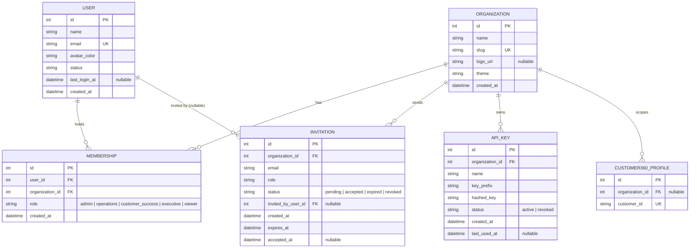

# Customer360 Enterprise Lakehouse Architecture

## High-Level Architecture

                        Public Datasets
                              │
                              ▼
                    Batch & Streaming Ingestion
                              │
          ┌───────────────────┴───────────────────┐
          ▼                                       ▼
     Batch Loader                         Event Producer
          │                                       │
          └───────────────────┬───────────────────┘
                              ▼
                       Bronze Data Layer
                              │
                              ▼
                       Spark Transformations
                              │
                 Bronze → Silver → Gold
                              │
                              ▼
                    PostgreSQL Analytics
                              │
          ┌───────────────────┴───────────────────┐
          ▼                                       ▼
     FastAPI REST API                   Streamlit Dashboard

## Demo & Pipeline Monitoring Layer

`/demo` and `/demo/pipeline` are unauthenticated, read-only views layered on
top of the same FastAPI process and PostgreSQL database as the real API --
not a separate service, and not the Streamlit dashboard referenced above.

                 PostgreSQL (customer360_profiles, outbox_events)
                              │
                              ▼
              Customer360Repository / OutboxRepository
                    (same repository layer as /api/v1/*)
                              │
              ┌───────────────┴───────────────┐
              ▼                                ▼
      /demo/api/* (v1.1)              /demo/api/pipeline/* (this feature)
   customers, summary, search      summary, events, services, charts,
                                          customer/{id}
              │                                │
              ▼                                ▼
       /demo dashboard                  pipeline_telemetry.py
     (real customer data)          deterministic, time-seeded simulator
                                   for Kafka/outbox/retry/DLQ telemetry
                                   that has no live backing in this
                                   deployment (see README -> Pipeline
                                   Monitor and -> Limitations)
                                                │
                                                ▼
                                   /demo/pipeline dashboard
                              (KPI cards, flow viz, charts, service
                               health, illustrative customer event flow)

Real vs. simulated at a glance:

| Real (from PostgreSQL)                          | Simulated (`pipeline_telemetry.py`)         |
| ------------------------------------------------ | -------------------------------------------- |
| Total customers / transactions                   | Kafka throughput, events/sec, consumer lag   |
| `outbox_events` row count, if any exist           | Retry queue depth, DLQ depth                 |
| Database reachability (`SELECT 1`)                | Kafka/Consumer/Outbox/Scheduler service health |
| `PostgreSQL` pipeline stage count                 | Producer/Kafka Topic/Outbox/Consumer/Retry/DLQ stage counts |
| A selected customer's real `created_at`           | The rest of that customer's event-flow timeline |

## Pipeline Control Center (v1.2)

`pipeline_telemetry.py` above is a pure function of time -- no memory
between requests, by design. The Control Center toolbar on
`/demo/pipeline` (Generate/Replay/Inject Failure/Retry/Recover/Reset)
needs the opposite: an action in one HTTP request must be visible in a
later, separate request. That real, cross-request state lives in one
place only:

                    POST /demo/api/pipeline/{generate,replay,
                         failure,retry,recover,reset}
                    GET  /demo/api/pipeline/state
                              │
                              ▼
                 PipelineSimulationEngine (singleton)
          thread-safe, in-memory, shared by every visitor --
          the single source of truth for interactive state
                              │
              ┌───────────────┴───────────────┐
              ▼                                ▼
   best-effort mirror via the            additively overlaid onto
   existing, unmodified                  pipeline_telemetry.py's
   OutboxRepository.add() /              ambient summary/services
   mark_published() /                    output, inside main.py --
   increment_retry()                     pipeline_telemetry.py itself
   (real outbox_events row,              was not modified; at the
   only when the DB is                   engine's idle state every
   reachable; never required)            delta is 0 (no-op overlay)

No `random` calls anywhere in `pipeline_simulation_engine.py`: event
type/customer selection cycles off a sequence counter, and retry
resolution is a deterministic rule (succeeds iff `consumer_healthy`,
else increments toward a fixed `max_retries` before routing to the DLQ)
-- not a coin flip. See README -> Pipeline Control Center for the full
reasoning and the one caveat worth knowing before relying on this in a
demo with concurrent visitors: the engine is global, not per-session.

## Workspace Shell (Customer360 Cloud, v2.0)

`/workspace` is a single-page, sidebar-navigated shell (Overview,
Customers, Event Center, Pipeline, Monitoring, Analytics, Audit Logs, API
Explorer, Settings) layered entirely on top of the pieces above -- it
introduces two new endpoints and two new engine methods, and otherwise
composes existing routes/data. `/demo`, `/demo/pipeline`, and every
`/demo/api/*` route are unmodified and still work standalone.

The one genuinely new capability is a real customer edit that produces a
real event, instead of the Control Center's manual "Generate Customer
Event" button:

                PATCH /demo/api/customers/{customer_id}
                              │
                 Customer360Repository.update()
                (existing method, real Postgres write)
                              │
                 diff which field(s) actually changed
              (email / city+state / else "Customer Updated")
                              │
              ENGINE.record_customer_update(customer_id, event_type)
        (new method: same happy-path trace shape as generate_event,
         always succeeds -- failures stay an explicit Control Center
         action -- and best-effort mirrors a real outbox_events row via
         the existing OutboxRepository, exactly like generate_event does)
                              │
                              ▼
              GET /demo/api/pipeline/history (new, new)
      (ENGINE.get_trace_history(): most-recent-first list of every
       event this engine has produced -- Control Center actions AND
       real customer edits alike -- each with its full per-stage trace)
                              │
              ┌───────────────┼───────────────────────────┐
              ▼               ▼                           ▼
       Event Center     Audit Logs                  Customers timeline
    (event-level table) (step-level trace:      (same history, filtered
                         Producer→Kafka Topic→     to one customer_id)
                         Outbox→Consumer→
                         PostgreSQL, or Retry
                         Queue/DLQ on failure)

Everything else in the shell reuses existing read-only endpoints without
any new backend code:

| Workspace view | Backend source |
| --------------- | --------------- |
| Overview        | `/demo/api/summary`, `/demo/api/pipeline/summary`, `/demo/api/pipeline/services`, `/demo/api/pipeline/history`, `/demo/api/customers` (client-side aggregation) |
| Customers       | `/demo/api/customers`, `/demo/api/customers/{id}`, new `PATCH .../{id}`, `/demo/api/pipeline/history` (client-filtered by customer) |
| Pipeline        | Same-origin `<iframe src="/demo/pipeline">` -- the existing dashboard, byte-for-byte. Parent JS reaches into the same-origin `iframe.contentDocument` after load to hide the page's own header and the "Generate Customer Event" button only (real edits already produce events); wrapped in try/catch so a structural change to `pipeline/index.html` degrades to "show the full page" rather than breaking |
| Monitoring      | `/demo/api/pipeline/summary`, `/services`, plus `history` for a "Recent Failures" list |
| Analytics       | `/demo/api/customers` (revenue/growth/state/top-customers, all computed client-side from real rows) + `/demo/api/pipeline/charts` (`top_event_types`, simulated) |
| Audit Logs      | `/demo/api/pipeline/history` at step level |
| API Explorer    | Same-origin `<iframe src="/docs">` -- `/docs` itself is unchanged and still directly reachable for developers/tooling |
| Settings        | `/health`, `/status`, and the existing `POST /demo/api/pipeline/reset` |

Like the Control Center, the workspace's ambient KPI numbers (throughput,
messages processed, etc.) remain `pipeline_telemetry.py`'s existing
time-seeded simulation -- a real customer edit is reflected precisely
(its own event, trace, and timeline entry), the same way the Control
Center's own actions have always been layered on top of that ambient
simulation rather than replacing it.

## Workspace Lifecycle & Audit Trail (v3.0)

v3.0 completes the customer lifecycle and adds the fields a real
operations/audit product needs, again by extending -- not rewriting -- the
v2.0 pieces above.

**Schema (one additive migration):** `customer360_profiles` gains
`status` (`'active'` | `'archived'`, default `'active'`) and `tags`
(JSON-encoded array stored as `TEXT`, default `'[]'`). Customer Score is
deliberately **not** a column -- it's computed client-side from spend,
transaction count, and recency, the same "derived, not stored" treatment
already used for the pre-existing Active/Dormant engagement label.

**Correlation ID -- zero engine changes.** `SimulatedEventResponse` gained
a Pydantic `@computed_field`, `correlation_id -> f"corr-{event_id}"`.
Deterministic, computed purely at the response layer, so every endpoint
that already returns this model (generate/replay/failure/retry/state/
history/the customer-update response) gained it for free.

**Before/after audit trail -- one new dataclass, one optional field.**
`pipeline_simulation_engine.py` gained `AuditEntry(actor, changes, before,
after)` and `EventTrace.audit: AuditEntry | None = None` (defaulted, so
every existing trace-construction site is unaffected). `record_customer_
update()` gained an optional `audit` parameter it threads straight
through -- it never computes the diff itself. That diff lives in
`main.py`'s `demo_update_customer` handler, which now builds one `before`/
`after` snapshot (name/email/city/state/**status**/**tags**) and derives
`changes = [k for k in before if before[k] != after[k]]` -- this single
list **replaces** v2's separate `email_changed`/`address_changed`
booleans and now also drives `event_type` selection, with `"Account
Archived"` added ahead of the existing rules whenever `status` changes to
`"archived"`.

                PATCH /demo/api/customers/{id}  {"status": "archived"}
                              │
              before = {..., status: "active", tags: [...]}
              (mutate profile.status = "archived")
              after  = {..., status: "archived", tags: [...]}
              changes = ["status"]  ->  event_type = "Account Archived"
                              │
              ENGINE.record_customer_update(id, event_type,
                  audit=AuditEntry("Workspace User", changes,
                                     before, after))
                              │
                              ▼
              GET /demo/api/pipeline/history
      (each entry's `audit` is populated for real customer edits,
       and `None` for Control Center demo actions -- both render
       through the same Event Center / Audit Logs code paths)

**Archive/Restore reuse the existing `PATCH` endpoint** (`{"status":
"archived"}` / `{"status": "active"}`) rather than a dedicated route --
consistent with "reuse existing APIs" and the same unauthenticated,
rate-limited, seeded-data-only surface as the rest of `/demo/api/*`.

**Frontend additions, all client-side aggregation over data other views
already fetch -- no further backend endpoints:**

| Feature | Source |
| --- | --- |
| Customer Score, pagination, status filter | Pure functions over `/demo/api/customers` (already fetched by the Customers view) |
| Customer Profile tabs (Overview/Timeline/Orders/Events/Audit/Pipeline Trace) | `/demo/api/pipeline/history` filtered to one `customer_id`; "Orders" is an honest relabeling of `transaction_count`/`total_spend`/`average_transaction_value` -- no fabricated per-order rows, since no per-order table exists |
| Monitoring's Latency/Retry/DLQ trend charts | `/demo/api/pipeline/charts` (already fetched elsewhere) |
| Monitoring's Service Uptime | Computed instant snapshot (healthy services ÷ total, right now) -- explicitly **not** a fabricated historical percentage, since no service-status history is stored anywhere |
| Analytics' CLV / Active Customers / Pipeline Metrics | `/demo/api/customers` + `/demo/api/pipeline/summary` (already fetched) |
| Overview's Customer Growth sparkline, Upcoming Tasks | Reuses Analytics' `growthByWeek`; tasks are real derived signals (nonzero DLQ/retry-queue/archived counts) linking to the relevant view -- never a fabricated generic to-do list |
| Global Search | Client-side match over the same customers + history payloads the Customers/Event Center views already fetch, cached once per session |
| Notification Center | Derived from `/demo/api/pipeline/history` + `/services` -- "successful recoveries" are identified structurally (`retry_count > 0` and final `status == "success"`); unread count is tracked via a `localStorage` timestamp, since there's no session/auth concept to hang it off of |

**Customer Profile deep-linking.** Selecting a customer updates the URL
to `#/customers/{customer_id}` via `history.replaceState` (not
`location.hash`), so it doesn't fire a redundant `hashchange` -- the view
isn't changing, only which customer is shown within it. The hash router's
`parseViewFromHash` now takes only the first path segment, so plain
`#/customers` links are unaffected; a new `parseHashParam` extracts the
customer id for direct/shared URLs and Global Search results. This is a
simplification, not full router history: back/forward doesn't step
through past selections, only the initial navigation and shareable-URL
cases are handled.

## Multi-Tenancy (v3.5)

v3.5 turns the single-user workspace above into a real multi-tenant
product: Organizations, Users, Roles, Memberships, Invitations, and API
Keys, all as real SQLAlchemy models with a real migration -- not
client-side fixtures. It is additive on top of every v2.0/v3.0 piece:
`/customers`, `/api/v1/customers*`, and every existing test remain
byte-for-byte unaffected, because every new behavior below is
**session-gated** -- no session cookie present, and the code takes
exactly the pre-v3.5 path.

**Entity relationship diagram:**

**Demo-tier session, not real auth.** `SessionMiddleware` (Starlette's
built-in, signed-cookie, no server-side store) is added to `main.py` with
`SESSION_SECRET_KEY` (env var, or a per-process random fallback -- fine
since this is a demo convenience, not a security boundary). `POST
/demo/api/auth/login` takes `{user_id}` -- there is deliberately no
password or email-verification step, matching this app's existing
"pick who you're signing in as" convention for demo/workspace routes.
`customer360/tenancy/session.py`'s `get_session_context(request, db)`
re-reads `User`/`Membership`/`Organization` from the database on every
call (so a role change or org rename takes effect on the very next
request) and returns `None` on any missing/invalid session -- the single
optional dependency every session-aware endpoint below is built on.

**Fixed roles, not a database table.** The spec's five roles are a
closed set, not user-defined, so `customer360/tenancy/permissions.py`
encodes them as a Python `StrEnum` plus two permission maps:
`NAV_PERMISSIONS` (which roles may even see a given `/workspace` view)
and `ACTIONS` (`customers.edit`, `pipeline.operate`,
`organization.manage`, each a set of allowed roles). `has_permission`/
`can_view` fail closed on any unknown role or key. The exact same maps
are mirrored in `workspace.js` (`NAV_PERMISSIONS`, `canView`) for
client-side nav hide/redirect -- the Python side is the enforcement
boundary; the JS side is presentation only.

**Org-scoping is additive at every call site it touches:**

                GET /demo/api/customers
                              │
              session present?  ──No──►  repository.list_all()
                              │                (unchanged, v1.1 behavior)
                             Yes
                              │
              repository.list_by_organization(session.organization_id)
                     (new method; list_all() itself never changed)

`PATCH /demo/api/customers/{id}` gains the mirror-image check: 404 if a
session exists and the customer's `organization_id` doesn't match it
(org isolation), 403 if the session's role lacks `customers.edit`, and
the `AuditEntry.actor` becomes the real signed-in user's name instead of
the hardcoded `"Workspace User"` -- falling back to `"Workspace User"`
when there's no session, so pre-v3.5 tests see identical output.
`SimulatedEvent` gained two more defaulted fields, `organization_id` and
`triggered_by`; only `record_customer_update()` threads them through, so
Control Center actions (`generate`/`inject_failure`/`retry`/`recover`/
`reset`) naturally keep `organization_id=None`/`triggered_by=None` --
rendered as "Shared Demo" / "System" in the UI, an honest reflection
that those really are anonymous, global, shared-state actions rather
than per-user ones. `GET /demo/api/pipeline/history` filters to
`event.organization_id == session.organization_id OR event.organization_id
is None` only when a session exists, so shared Control Center events stay
visible to everyone while real per-org customer events are isolated.

**Management endpoints** (`customer360/api/tenancy_routes.py`, all under
`/demo/api/*`, same unauthenticated-by-`X-API-Key` convention as the rest
of that surface -- `/api/v1`'s real `verify_api_key` auth is untouched)
cover auth (login/logout/session/switch-workspace), organization signup
and branding, membership listing/role-change/removal, invitation
send/accept/revoke, and API key generate/rotate/revoke/verify. Every
mutation that isn't self-service (branding, membership changes,
invitations, API keys) is gated by `require_permission("organization.
manage")`, which only 403s when a session is present -- so this entire
router is invisible to the pre-v3.5 test suite, which never sends a
session cookie.

**API keys are real but display-scoped.** `ApiKey` rows, generation
(`sk_live_{32 random bytes}`, sha256-hashed at rest, shown in full
exactly once), rotation, revocation, and `last_used_at` tracking are all
real and backed by the database. `POST /demo/api/api-keys/verify`
(header `X-Org-API-Key`) is the one place a key is actually checked --
but `/api/v1`'s existing static-key auth is intentionally untouched, so
these keys don't functionally gate anything outside `/demo/api/*` today.

**Descoped, on purpose:** the spec's "user @mentions" and "task
assignment" notifications have no underlying data model anywhere in this
app (no comments/@mentions/task-assignment concept exists); rather than
fabricate fake ones, only the real "Invitation accepted" notification
type was added, derived from actual `Invitation.status` transitions,
matching the "derive, don't fabricate" rule already applied to Orders/
Uptime/Upcoming Tasks in v3.0.
